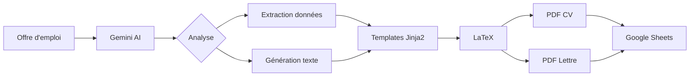

# 🤖 Job Application Bot - Assistant PFE Data Engineer

**Un outil d'automatisation intelligent pour personnaliser vos candidatures avec l'IA**


## 📋 Vue d'ensemble

Ce projet est un **assistant d'automatisation semi-automatisé** qui utilise l'intelligence artificielle (Google Gemini) pour analyser des offres d'emploi et générer automatiquement des CV et lettres de motivation **personnalisés** en PDF.

### ✨ Pourquoi ce projet ?

1. **Gain de temps** : Plus besoin de réécrire votre CV/lettre pour chaque candidature
2. **Personnalisation IA** : Chaque document est adapté aux besoins spécifiques de l'offre
3. **Qualité professionnelle** : PDF générés avec LaTeX pour un rendu impeccable
4. **Suivi centralisé** : Toutes vos candidatures trackées dans Google Sheets
5. **100% gratuit** : Utilise uniquement des APIs et outils gratuits
6. **Portfolio** : Démontre vos compétences en Python, APIs, automatisation et data engineering

### 🎯 Pour qui ?

- Étudiants en Data Engineering/Science en recherche de stage/emploi
- Candidats souhaitant optimiser leur processus de candidature
- Développeurs voulant un projet concret pour leur portfolio

## 🏗️ Architecture



**Stack Technique :**
- **Backend** : Python 3.8+
- **IA** : Google Gemini 1.5 Flash API (gratuit)
- **Templates** : Jinja2
- **PDF** : LaTeX (pdflatex)
- **Tracking** : Google Sheets API
- **Config** : python-dotenv

## 📦 Installation

### Prérequis

1. **Python 3.8 ou supérieur**
   ```bash
   python --version
   ```

2. **Distribution LaTeX** (pour générer les PDF)
   
   **Windows :**
   - Téléchargez [TeX Live](https://tug.org/texlive/) ou [MiKTeX](https://miktex.org/)
   - Installez avec les options par défaut
   - Vérifiez : `pdflatex --version`
   
   **Mac :**
   ```bash
   brew install --cask mactex
   ```
   
   **Linux (Ubuntu/Debian) :**
   ```bash
   sudo apt-get install texlive-full
   ```

### Installation du projet

1. **Clonez ou téléchargez le projet**
   ```bash
   git clone https://github.com/votre-username/job-application-bot.git
   cd job-application-bot
   ```

2. **Installez les dépendances Python**
   ```bash
   pip install -r requirements.txt
   ```

3. **Configurez vos clés API**
   
   Copiez le fichier d'exemple :
   ```bash
   cp .env.example .env
   ```
   
   Éditez `.env` et ajoutez votre clé Gemini :
   ```
   GEMINI_API_KEY=votre_cle_api_ici
   ```
   
   > 🔑 **Obtenir une clé Gemini gratuite** : https://aistudio.google.com/

4. **(Optionnel) Configuration Google Sheets**
   
   Pour le suivi automatique, voir [SETUP_GUIDE.md](SETUP_GUIDE.md)

## 🚀 Utilisation

### Mode simple (sans Google Sheets)

1. **Lancez l'application**
   ```bash
   python app.py
   ```

2. **Suivez les instructions**
   - Collez le texte de l'offre d'emploi
   - Appuyez sur Entrée deux fois pour valider
   - Ou tapez `DEMO` pour tester avec l'offre d'exemple

3. **Vérifiez les résultats**
   - Les PDF sont générés dans `candidatures_genere/`
   - Ouvrez et vérifiez avant envoi !

### Exemple de workflow complet

```
1. 🔍 Recherche sur LinkedIn/Welcome to the Jungle
2. 📋 Copie du texte de l'offre
3. ▶️ Lancement : python app.py
4. 📝 Collage du texte
5. 🤖 IA analyse et génère
6. ✅ Vérification des PDF
7. 📧 Envoi de la candidature
```

## 📁 Structure du projet

```
job-application-bot/
├── app.py                      # Script principal
├── config.py                   # Configuration
├── utils.py                    # Fonctions utilitaires
├── requirements.txt            # Dépendances Python
├── .env.example               # Template de configuration
├── .gitignore                 # Fichiers à ignorer
├── README.md                  # Ce fichier
├── SETUP_GUIDE.md            # Guide détaillé
├── templates/                 # Templates LaTeX
│   ├── template_cv.tex
│   └── template_lettre.tex
├── examples/                  # Exemples
│   └── sample_job_offer.txt
└── candidatures_genere/      # PDF générés (créé auto)
```

## 🎨 Personnalisation

### Modifier vos informations

Éditez le fichier `.env` :
```env
USER_NAME=Votre Nom
USER_PROFILE=Vos compétences principales
USER_EXPERIENCE=Votre expérience clé
```

### Personnaliser les templates LaTeX

Les templates sont dans `templates/` :
- `template_cv.tex` : Structure du CV
- `template_lettre.tex` : Structure de la lettre

Variables Jinja2 disponibles :
- `\VAR{company_name}` : Nom de l'entreprise
- `\VAR{job_title}` : Titre du poste
- `\VAR{ai_generated_paragraph}` : Texte généré par l'IA
- `\VAR{keywords}` : Mots-clés extraits

## 🔒 Sécurité & Bonnes pratiques

> [!WARNING]
> **LinkedIn et le scraping**
> 
> Ce bot **NE fait PAS de scraping automatique**. Vous copiez manuellement le texte pour éviter :
> - Le bannissement de votre compte LinkedIn
> - Les violations des conditions d'utilisation
> - Les détections anti-bot

> [!IMPORTANT]
> **Protection des credentials**
> 
> - Ne committez **JAMAIS** votre `.env` ou `credentials.json`
> - Le `.gitignore` est configuré pour les exclure
> - Vérifiez avant chaque `git push`

## 📊 Exemple de résultat

Après exécution :

```
✓ Analyse terminée: Effidic - Data Engineer
✓ Template rendu: Lettre_Gad_Nguette_Effidic.tex
✓ PDF généré: Lettre_Gad_Nguette_Effidic.pdf
✓ Template rendu: CV_Gad_Nguette_Effidic.tex
✓ PDF généré: CV_Gad_Nguette_Effidic.pdf
✓ Ajouté à Suivi_Candidatures_PFE
```

## 💡 Avantages pour votre portfolio

### Ce projet démontre :

✅ **Data Engineering** : Pipeline de traitement de données (extraction → transformation → chargement)  
✅ **APIs** : Intégration Google Gemini et Google Sheets  
✅ **Automatisation** : Scripting Python avancé  
✅ **Template Engineering** : Jinja2 + LaTeX  
✅ **Best Practices** : Config management, error handling, logging  
✅ **Documentation** : README, guides, code commenté  

### Ajouts possibles pour aller plus loin :

- [ ] Interface web avec Flask/Streamlit
- [ ] Base de données SQLite pour historique
- [ ] Tests unitaires (pytest)
- [ ] CI/CD avec GitHub Actions
- [ ] Docker container
- [ ] Analyse de CV existant vs offre (match score)

## 🐛 Dépannage

### Erreur : `pdflatex` not found

**Problème** : LaTeX n'est pas installé ou pas dans le PATH

**Solution** :
1. Installez TeX Live/MiKTeX
2. Ajoutez au PATH (Windows : Paramètres système)
3. Redémarrez le terminal

### Erreur : No JSON found in AI response

**Problème** : Gemini n'a pas retourné un JSON valide

**Solution** :
- L'offre est peut-être trop courte ou mal formatée
- Le bot utilise des valeurs par défaut automatiquement
- Vérifiez le texte de l'offre

### Erreur : Google Sheets API

**Problème** : Credentials invalides ou Sheet non trouvé

**Solution** :
- Vérifiez que `credentials.json` existe
- Le nom du Sheet doit correspondre à `.env`
- Voir [SETUP_GUIDE.md](SETUP_GUIDE.md) pour config complète

## 🤝 Contribution

Les contributions sont bienvenues ! N'hésitez pas à :
- Signaler des bugs (Issues)
- Proposer des améliorations (Pull Requests)
- Partager vos retours d'expérience

## 📄 Licence

MIT License - Libre d'utilisation pour vos projets personnels et professionnels.

## 📞 Contact

Créé par **Gad Nguette** - Data Engineering Student

---

**⭐ Si ce projet vous aide, n'hésitez pas à mettre une étoile sur GitHub !**
